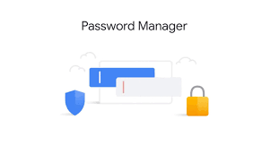

## Application name
Password Locker

## Description
This application is used to manage password for users.
It also generates user passwords.
The user must however sign up to all accounts with passwords.

## Operating
The pc must first have python installed.
Then run (python3.6 run.py) in the terminal.
The user must first sign into all their accounts using their passwords inorder to store and manage their password.
Afterwards, the user only logs into the system.
Also the user can also see all the signed in accounts.

##  Technology used
I used python to create the application.

## Troubleshooting
If you encounter any problems please feel free to contact me on the contacts provided in the web application and also below.

## Support and contact details
Contact us on : 074658743
Email us on: marknesh@gmail.com

## Contributors
[marknesh]

## MIT License

Copyright (c) [2020] [marknesh]

Permission is hereby granted, free of charge, to any person obtaining a copy
of this software and associated documentation files (the "Software"), to deal
in the Software without restriction, including without limitation the rights
to use, copy, modify, merge, publish, distribute, sublicense, and/or sell
copies of the Software, and to permit persons to whom the Software is
furnished to do so, subject to the following conditions:

The above copyright notice and this permission notice shall be included in all
copies or substantial portions of the Software.

